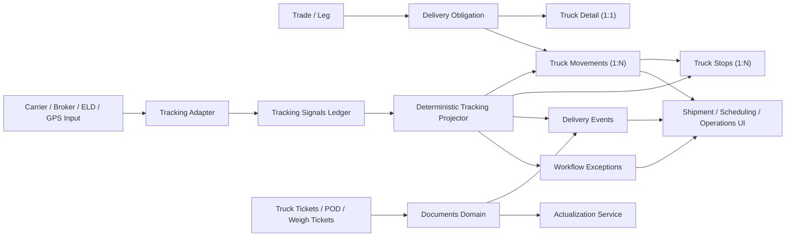

# Truck Tracking System Architecture

## Purpose

This document proposes the first durable architecture for truck tracking inside
ECTRM.

The goal is not to bolt on a separate fleet product. The goal is to extend the
existing delivery, shipment, scheduling, document, and workflow seams so truck
movements can be tracked with the same governed operating model as the rest of
the platform.

## Related Docs

- [Platform Blueprint](./platform-blueprint.md)
- [ADR 0002: V2 Application Architecture And Canonical Domain Boundaries](../adr/0002-v2-application-architecture.md)
- [Governed Core Platform Boundary Reset](./core-platform-boundary-reset.md)
- [Canonical Work Object Inventory](./canonical-work-object-inventory.md)
- [Rail Delivery Schema](./rail-delivery-schema.md)
- [Scheduling UI Design Review](./scheduling-ui-design-review.md)
- [Trading And Shipping Document Taxonomy](./document-taxonomy-trading-shipping.md)
- [Truck Tracking System Work Packages](./truck-tracking-system-work-packages.md)
- [Human-Agent Authority Matrix](./human-agent-authority-matrix.md)

## Why Truck Tracking Needs A Dedicated Slice

The current delivery model is already strong enough for obligation-level
visibility:

- `delivery_obligations` gives the platform a canonical movement-facing object
- `delivery_events` provides append-only milestone history
- `trade_actualizations` supports delivered-quantity capture
- shipment and scheduling workspaces already surface readiness, blockers, and
  workflow state

That is a strong base, but truck operations need more detail than a single
delivery row can safely hold:

- one delivery obligation may require many discrete truck loads
- dispatch, pickup, transit, arrival, unload, and proof-of-delivery are
  separate operational checkpoints
- live GPS, ELD, carrier, and broker signals arrive at much higher frequency
  than business events
- truck tickets, weigh tickets, and POD documents affect actualization and
  settlement readiness
- schedulers need ETA, dwell, and delay exception visibility without turning
  telemetry directly into official quantity or commercial truth

The right answer is to deepen the existing delivery model, not replace it.

## Architecture Principles

1. Keep `delivery_obligations` as the canonical parent work object.
2. Model discrete truck loads as child work objects under a delivery
   obligation.
3. Keep raw tracking signals append-only and separate from accepted business
   events.
4. Let deterministic services own matching, milestone projection, ETA,
   dwell, and exception rules.
5. Keep quantity actualization and commercial consequences behind typed
   application services.
6. Preserve manual fallback, correction history, and audit at every step.
7. Treat maps, ETAs, and dashboards as projections, not the only source of
   operational truth.

## Current Repo Anchors

The proposed slice should extend existing seams instead of introducing a
parallel subsystem.

Backend anchors:

- `apps/api/app/domains/operations/routes/shipments.py`
- `apps/api/app/domains/operations/routes/deliveries.py`
- `apps/api/app/domains/operations/services/shipments.py`
- `apps/api/app/domains/operations/services/actualizations.py`
- `apps/api/app/models/delivery_obligation.py`
- `apps/api/app/models/delivery_logistics_detail.py`
- `apps/api/app/models/delivery_event.py`
- `apps/api/app/models/trade_actualization.py`
- `apps/api/app/schemas/shipment.py`
- `apps/api/app/shared/enums.py`

Frontend anchors:

- `apps/web/src/workspaces/shipments/ShipmentWorkspace.tsx`
- `apps/web/src/workspaces/shipments/DeliveryDetailEditor.tsx`
- `apps/web/src/workspaces/shipments/DeliveryEventTimelineEditor.tsx`
- `apps/web/src/workspaces/scheduling/SchedulingWorkspace.tsx`
- `apps/web/src/workspaces/operations/OperationsWorkspace.tsx`
- `apps/web/src/entities/shipments/api.ts`

## Proposed Work Object Model

Truck tracking should introduce one new durable child object and one new raw
evidence object while keeping the existing delivery hierarchy intact.

| Work object | Status | Purpose |
| --- | --- | --- |
| `DeliveryObligation` | Existing | Parent obligation tied to trade and leg context. |
| `DeliveryTruckDetail` | Proposed | One-row-per-delivery truck-specific defaults and dispatch metadata. |
| `DeliveryTruckMovement` | Proposed | One row per dispatchable truck run under a delivery obligation. |
| `DeliveryTruckStop` | Proposed | One row per planned or actual stop under a truck movement. |
| `DeliveryTrackingSignal` | Proposed | Append-only normalized raw telemetry or carrier signal. |
| `DeliveryEvent` | Existing, extended | Accepted business milestone history and correction trail. |
| `TradeWorkflowItem` | Existing | Queue object for exceptions, assignments, and review. |
| `DocumentIngestion` and links | Existing | Truck tickets, PODs, weigh tickets, and delivery evidence. |
| `TradeActualization` | Existing | Official delivered quantity after approved evidence or manual entry. |

### Parent-child shape

- one `DeliveryObligation` may have zero, one, or many `DeliveryTruckMovement`
  rows
- one `DeliveryTruckMovement` may have one or many `DeliveryTruckStop` rows
- one `DeliveryTruckMovement` may have many `DeliveryTrackingSignal` rows
- one `DeliveryTruckMovement` may contribute many `DeliveryEvent` rows, either
  directly or through projected accepted checkpoints
- `TradeActualization` stays delivery-owned and is not replaced by movement
  telemetry

This preserves the current commercial-to-operations hierarchy:

`Trade -> DeliveryObligation -> TruckMovement -> TruckStop -> TrackingSignal/Event/Document`

## Proposed Domain Ownership

The slice should align with the authority-first seam model from the core
platform docs.

| Seam | Owns |
| --- | --- |
| `operations` | truck detail, truck movement lifecycle, manual tracking updates, movement readiness, milestone acceptance |
| `workflow` | truck exception queue state, reviewer assignment, escalation, approval metadata |
| `documents` | truck ticket, weigh ticket, POD attachment, extraction, and linkage evidence |
| `integrations` | carrier, broker, telematics, and ELD adapter contracts plus webhook or polling adapters |
| `reference_data` | carrier catalog, equipment types, reason codes, optional tracking geofences when they become reusable master data |
| `settlement` | invoice and payment consequences after actualization is trusted |
| `ai_gateway` | explanation, drafting, and staged follow-up only |

Truck tracking should not become a report-only rule set, a map-only subsystem,
or an assistant-owned workflow.

## Target Backend Placement

The first implementation can stay inside the current modular monolith.

Recommended additive placement:

```text
apps/api/app/domains/
  operations/
    models/
      delivery_truck_detail.py
      delivery_truck_movement.py
      delivery_truck_stop.py
      delivery_tracking_signal.py
    routes/
      deliveries.py
      shipments.py
      truck_tracking.py
    services/
      truck_movements.py
      tracking_signals.py
      tracking_projection.py
      truck_exceptions.py
  integrations/
    routes/
      tracking_webhooks.py
    services/
      tracking_adapters.py
      tracking_normalization.py
```

This is an additive direction, not a demand for a one-commit rewrite.

## Target Frontend Placement

Truck tracking should extend the current workspaces instead of creating a
detached one-off screen first.

Recommended placement:

```text
apps/web/src/
  workspaces/
    shipments/
      TruckMovementBoard.tsx
      TruckMovementEditor.tsx
      TruckStopEditor.tsx
      TruckMovementTimeline.tsx
    scheduling/
      TruckDispatchBoard.tsx
      TruckExceptionPanel.tsx
    operations/
      TruckExceptionQueue.tsx
  entities/
    shipments/
      api.ts
```

The first truck slice should appear inside:

- Shipment workspace for per-delivery load planning and history
- Scheduling workspace for dispatch, stage, and near-term follow-through
- Operations workspace for cross-delivery exceptions and stale tracking

## Data Model Direction

### 1. `delivery_truck_details`

This is a one-row-per-delivery extension for truck-specific defaults and
dispatch context.

Recommended first-cut fields:

- `delivery_id`
- `target_load_count`
- `default_carrier_code` or temporary `default_carrier_name`
- `dispatcher_owner`
- `equipment_type`
- `pickup_appointment_start`
- `pickup_appointment_end`
- `delivery_appointment_start`
- `delivery_appointment_end`
- `tracking_provider`
- `tracking_policy`
- optional `origin_geofence_code`
- optional `destination_geofence_code`
- audit, version, and `<field>_source` metadata

This record should carry reusable per-delivery truck context. It should not try
to hold every individual truck run.

### 2. `delivery_truck_movements`

This is the core new work object. One row represents one dispatchable truck
run that may contain one or many stops.

Recommended first-cut fields:

- `movement_id`
- `delivery_id`
- `sequence_no`
- `status`
- `planned_quantity`
- `planned_unit_of_measure`
- `carrier_code` or temporary `carrier_name`
- `driver_name`
- `driver_phone`
- `tractor_reference`
- `trailer_reference`
- `external_load_reference`
- `bill_of_lading_number`
- `truck_ticket_number`
- `current_stop_sequence`
- `current_location_code` or derived current stop reference
- `last_signal_at`
- `current_eta_at_destination`
- `delay_reason_code`
- `created_at`, `created_by`, `updated_at`, `updated_by`, `version`

Recommended truck movement status model:

- `PLANNED`
- `ASSIGNED`
- `AT_ORIGIN`
- `LOADED`
- `IN_TRANSIT`
- `AT_DESTINATION`
- `UNLOADED`
- `COMPLETED`
- `ON_HOLD`
- `CANCELLED`

This movement status is more granular than the current delivery-level
`DeliveryExecutionStatus`. The delivery obligation should roll up from movement
state, not lose that higher-level summary.

### 3. `delivery_truck_stops`

Multi-stop support should land as a first-class child model instead of trying
to stretch one origin/destination pair across the whole truck run.

Recommended first-cut fields:

- `stop_id`
- `movement_id`
- `stop_sequence`
- `stop_type` such as `PICKUP`, `DROPOFF`, or `WAYPOINT`
- `location_code`
- `planned_arrival_start`
- `planned_arrival_end`
- `planned_departure_start`
- `planned_departure_end`
- `actual_arrived_at`
- `actual_departed_at`
- `appointment_reference`
- `status`
- `planned_quantity`
- `actual_quantity` when stop-level quantity evidence is available
- `created_at`, `created_by`, `updated_at`, `updated_by`, `version`

This keeps point-to-point trucking as a simple two-stop case while giving the
first slice room for milk runs, split drops, and multi-pick movements without a
schema rewrite.

### 4. `delivery_tracking_signals`

Tracking signals should capture normalized raw evidence without pretending it
is already accepted business truth.

Recommended first-cut fields:

- `signal_id`
- `movement_id` when confidently matched, otherwise nullable plus unresolved
  linkage metadata
- optional `stop_id` or `stop_sequence` when the signal maps cleanly to a
  specific stop
- `delivery_id` when known
- `source_system`
- `source_event_id`
- `signal_type`
- `occurred_at`
- `received_at`
- `latitude`
- `longitude`
- `location_code` when mapped
- `external_status`
- `normalized_status`
- `match_confidence`
- `dedupe_key`
- `raw_payload` JSON
- `processing_status`
- `processing_error`

Signals are evidence. They should never be the only place an operator can see
what happened, and they should not auto-actualize quantities.

## Event And Milestone Model

The existing `delivery_events` table should remain the canonical business event
history for accepted milestones.

For truck tracking, do not explode the top-level delivery event taxonomy before
it is necessary. The first slice can preserve the shared event families and add
truck-specific detail under them.

Recommended direction:

- continue using `CHECKPOINT_RECORDED` for accepted movement checkpoints
- add a typed `checkpoint_code` to distinguish truck milestones
- optionally add `movement_id`, `stop_id`, `source_signal_id`,
  `source_confidence`, and `exception_code`

Suggested first checkpoint codes:

- `DISPATCH_ASSIGNED`
- `ARRIVED_PICKUP`
- `LOADED`
- `DEPARTED_PICKUP`
- `DELAY_REPORTED`
- `ARRIVED_DESTINATION`
- `UNLOADED`
- `POD_CAPTURED`

This keeps the event store append-only and lets the platform accept or reverse
truck-specific operational facts without overloading the raw signal ledger.

## Tracking Processing Flow



## Deterministic Services To Add

Truck tracking creates several repeated judgment paths that belong in typed
services rather than prompts or UI helpers.

### Signal-to-movement and stop matching

Question:

- Which truck movement and stop does this signal belong to?

Inputs:

- delivery ID when present
- external load reference
- bill of lading or ticket references
- carrier reference
- tractor or trailer reference
- signal timestamp
- geofence or mapped location context

Outputs:

- matched `movement_id`
- optional matched `stop_id`
- confidence band
- unresolved reason when no safe match exists

Stop conditions:

- multiple open movements match equally
- multiple candidate stops on the same movement match equally
- missing carrier or external reference
- signal is too stale to trust
- the matched movement is already completed or cancelled

### Milestone projection

Question:

- Should a raw signal create or update an accepted business milestone?

Inputs:

- signal type and normalized status
- prior movement status
- recent accepted checkpoints
- provider confidence
- manual override or hold state

Outputs:

- accepted checkpoint
- ignored duplicate
- staged conflict for human review

Stop conditions:

- checkpoint would move backward without correction context
- a manual hold blocks auto-progression
- signals conflict with already accepted document evidence

### ETA, lateness, and dwell classification

Question:

- Is the movement on time, at risk, or operationally stalled?

Inputs:

- appointment windows
- last known accepted checkpoint
- signal freshness
- current ETA
- configured dwell thresholds

Outputs:

- `ON_TIME`, `AT_RISK`, `LATE`, or `STALE_TRACKING`
- dwell timer state
- recommended workflow item or escalation

Stop conditions:

- signal freshness below threshold
- origin or destination appointment windows are missing
- the movement is on manual hold

## API Blueprint

Truck tracking should extend existing shipment APIs and add an integration-safe
ingest boundary.

Recommended first API surface:

- `GET /shipments?transport_mode=TRUCK`
- `PATCH /deliveries/{delivery_id}/truck-details`
- `POST /deliveries/{delivery_id}/truck-movements`
- `PATCH /truck-movements/{movement_id}`
- `POST /truck-movements/{movement_id}/stops`
- `PATCH /truck-stops/{stop_id}`
- `GET /truck-movements/{movement_id}`
- `GET /truck-movements/{movement_id}/timeline`
- `POST /truck-movements/{movement_id}/events`
- `POST /integrations/tracking/providers/{provider}/events`

Design rules:

- external providers should hit an integration adapter route, not business
  mutation routes directly
- business writes should still flow through typed operations services
- movement and actualization mutations should preserve stale-state checks and
  audit

## UI Blueprint

### Shipment workspace

Use the shipment workspace for delivery-level planning and movement detail.

First truck additions:

- movement list inside the selected delivery
- stop list and stop sequence editor inside a selected movement
- movement status and ETA badges
- references for carrier, tractor, trailer, BOL, truck ticket, and POD
- accepted milestone timeline beside raw tracking freshness

### Scheduling workspace

Use the scheduling workspace as the truck dispatch console.

First truck additions:

- stage-oriented truck queue: planned, assigned, in transit, arrived, blocked
- stop-aware dispatch sequence for multi-pick and multi-drop runs
- appointment-window urgency
- dispatch owner and carrier visibility
- quick exception triage for stale tracking, late arrival, and missing POD

### Operations workspace

Use the operations workspace for cross-delivery exception handling.

First truck additions:

- stale telemetry queue
- unmatched signal queue
- dwell and lateness exceptions
- actualization-ready versus document-missing queue slices

### Map view

Treat a map as a projection and inspection aid, not the only operating screen.

The first useful map slice should show:

- current movement position when a signal is fresh enough
- stop anchors in planned sequence
- current ETA and lateness color
- signal freshness warning when location is stale

## Reference Data Direction

Truck tracking should reuse existing reference data where possible:

- `locations` for origin and destination anchors
- `units` for movement and actualization quantity
- `commodities` for product context

Truck-specific reference additions are likely useful soon after the first
slice:

- carrier catalog
- equipment type catalog
- delay or exception reason codes
- optional tracking geofence catalog where reusable arrival logic matters

Do not block the first truck slice on a perfect reference-data program, but do
not let freeform carrier and exception labels become the permanent end state.

## Document And Actualization Relationship

Truck tracking should strengthen, not replace, the current document and
actualization path.

Recommended rules:

- truck tickets, weigh tickets, and PODs attach to the movement or delivery
  first
- actualization is derived from approved evidence or explicit operator entry,
  not directly from GPS
- accepted document evidence may generate or confirm delivery events
- quantity disputes and missing evidence should surface as workflow exceptions

This preserves the repo's core rule that durable business truth belongs in
typed services and reviewable records.

## Authority Boundary

Phase 1 truck tracking should be conservative.

The system may:

- ingest raw signals
- normalize and dedupe them
- project ETA and lateness
- create or update low-risk internal queue items
- accept low-risk checkpoint progression only when deterministic confidence is
  high and no manual hold or conflict exists

The system may not:

- actualize delivered quantity from telemetry alone
- reassign a carrier or commit external schedule changes autonomously
- send external carrier or customer communications without human review
- change settlement, invoice, payment, or policy state directly from tracking

Agents may explain, summarize, and draft follow-up. They should not become the
only mutation path for truck operations.

## Decisions Made

The following decisions are now locked for the first implementation slice:

1. Multi-stop support is in scope from the start.
   Point-to-point trucking should be treated as a simple case of the same
   `movement -> stops` model, not as a separate architecture.
2. Carrier identity starts as `carrier_name` plus an external carrier reference.
   A first-class `reference_carriers` catalog is deferred unless reporting,
   permissions, SLA policy, or reuse pressure justifies promoting it earlier.
3. Manual dispatcher updates define the first tracking contract.
   If an external feed is added early, prefer broker-portal-style milestone
   feeds before raw ELD telemetry.
4. Auto-projection is limited to low-risk location milestones first:
   `ARRIVED_PICKUP`, `DEPARTED_PICKUP`, and `ARRIVED_DESTINATION`.
5. Load, unload, POD, and delay milestones remain manual or review-backed
   until source quality and correction rates justify broader automation.

## Deferred On Purpose

The first architecture slice should not try to solve every fleet problem.

Deferred items:

- carrier procurement and rate tendering
- route optimization
- driver mobile application ownership
- autonomous counterparty or carrier messaging
- demurrage or detention economics as official settlement truth
- multi-enterprise visibility beyond owned or integrated deliveries
- a separate microservice split for truck tracking
